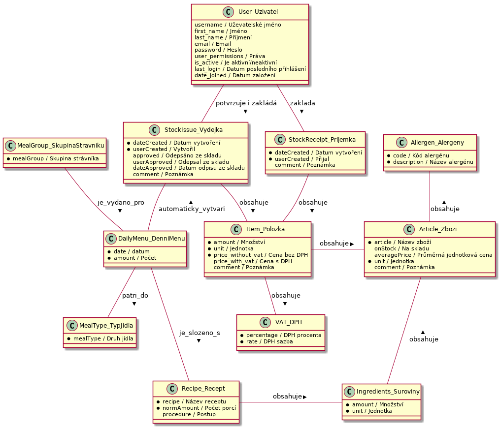

# KiCoMa - Kitchen cooking management

## Demo

Check the lastest version at [kicoma.stanislavvalasek.com](https://kicoma.stanislavvalasek.com).

## License

All source code in this repository is released under the **[CC BY‑NC 4.0](https://creativecommons.org/licenses/by‑nc/4.0/)** license.

- ❌ **Commercial use is not permitted**
- 🔒 No patent rights are granted
- 📝 Attribution and copyright notice must be included
- ⚠️ No liability and no warranty

If you'd like to use this software commercially, please [contact me](https://www.stanislavvalasek.com/en/contact/) to discuss a commercial license.

## Data Model



## Getting started

To get started with the app, clone the repo and then install Python 3:

```bash
cd ~/tmp
git clone https://github.com/valasek/kicoma
cd kicoma
```

### Start server locally

Just rebuild the dev container, app is running on port 8000

Alternativelly, install docker and docker compose and run `docker-compose up`

## Deploy to Hetzner

Commit your changes all relevant files into repo.

```bash
export KAMAL_REGISTRY_PASSWORD=<value>
kamal deploy
```

Connect to server: `ssh root@162.55.185.37`

## Upgrade packages

Run uv lock whenever you change pyproject.toml

uv sync --extra dev        # Install from lockfile

## Update all dependencies to latest compatible versions

Show outdated packages
uv tree --outdated --depth=1

uv lock --upgrade

## Generate lockfile without installing

uv lock --no-install

uv add new-package        # Adds to pyproject.toml and updates lockfile

uv remove old-package     # Removes from pyproject.toml and updates lockfile

## Generate lockfile for specific Python version

uv lock --python 3.11

## Update specific package

uv lock --upgrade-package django

## Update packages in specific group

uv lock --upgrade-package django --upgrade-package gunicorn

### When deploying for the first time, make sure these LOCAL ONLY config files exist

config/django_secret.key
e.g. ghenerate it using https://djecrety.ir

config/django_admin_url.key
/admin/ or more secure version

config/mailgun_api.key

config/mailgun_public.key

config/mailgun_smtp_login.key

config/mailgun_smtp_password.key

### Update Kamal or kamal proxy on localhost

```bash
gem update kamal
kamal proxy upgrade
```

### Path to sqlite

`/var/lib/docker/volumes/kicoma_storage/_data/`

### Sqlite backups to S3

Check if litestream is running:

`sudo journalctl -u litestream -f`

## Usefull Commands

### Run bash inside cosker container

`docker exec -it kicoma-web-1 bash`

### Reset Development DB

`./reset-db.sh`

### Generate user password for fixture

```bash
./manage.py shell
from django.contrib.auth.hashers import make_password
make_password('password')
```

### Generate DB model

Using [Graph models](https://django-extensions.readthedocs.io/en/latest/graph_models.html)

`python3 manage.py graph_models -a -g -o datamodel.png` or

`python3 manage.py graph_models kitchen -g -o datamodel.png` and copy the file to statics/images

### Update Translations

#### Generate message files for a desired language

`./manage.py makemessages -l en -l cs`

#### After adding translations to the .po files, compile the messages

`./manage.py compilemessages`

### Type checks

Running type checks with mypy:

`mypy kicoma`

### Test coverage

To run the tests, check your test coverage, and generate an HTML coverage report::

```bash
coverage run -m pytest
coverage html
open htmlcov/index.html
```

### Running tests

 ./manage.py test kitchen

### Check the production settings

`./manage.py check --deploy --settings=config.settings.production`

## Data Model


## Legacy

### Data migration

#### Export data from Heroku DB

```heroku run "python manage.py dumpdata --exclude auth.permission --exclude contenttypes" --app kicoma-tri > full_dump.json```

Log out all users by deleting all sessions

heroku run python manage.py shell -c --app kicoma-tri "from django.contrib.sessions.models import Session; Session.objects.all().delete()"

#### Import exported data on local machine

```bash
docker-compose exec kicoma_devcontainer-app python manage.py flush --noinput
docker-compose exec web python manage.py migrate
docker-compose exec web python manage.py loaddata full_dump.json

or 

docker exec b44a5dc4cfce87e70ab01036acf924d6496bcf974a974998488fdf3bc77ce13b python manage.py flush --noinput
docker exec b44a5dc4cfce87e70ab01036acf924d6496bcf974a974998488fdf3bc77ce13b python manage.py migrate
docker exec b44a5dc4cfce87e70ab01036acf924d6496bcf974a974998488fdf3bc77ce13b python manage.py loaddata full_dump.json
```

#### Import data from local machine into it into docker on Hetzner

**Get container ID**:

```bash
scp ./full_dump.json root@162.55.185.37:/root/full_dump.json
ssh root@162.55.185.37
CONTAINER_ID=$(docker ps --format '{{.ID}}' --filter 'name=kicoma-web-' --filter 'ancestor=svalasek/kicoma')
docker cp /root/full_dump.json $CONTAINER_ID:/app/full_dump.json
docker exec -it $CONTAINER_ID python3 manage.py flush --noinput
docker exec -it $CONTAINER_ID python3 manage.py loaddata full_dump.json
```

### Deploy to Heroku

```bash
heroku login
git push kicoma-tri master
```

[deployment-on-heroku](https://cookiecutter-django.readthedocs.io/en/latest/deployment-on-heroku.html)

[Managing Multiple Environments for an App](https://devcenter.heroku.com/articles/multiple-environments)

Do not forget to add the following argument at the end of every command:

`--app <app-name>`

`--app kicoma-tri`

#### Set email domain

`heroku config:set MAILGUN_DOMAIN=hospic-cercany.cz`

#### Initialize DB

### Reset Heroku DB

`heroku login`

`./reset-db-heroku.sh`

#### Usefull Heroku commands

```bash
heroku git:remote -a kicoma-tri
heroku apps:info -a kicoma-tri
heroku apps:stacks -a kicoma-tri
heroku buildpacks -a kicoma-tri
heroku config -a kicoma-tri
```

## Additional info for local development and Cookiecutter info

Check the original repo template:
[Developing locally](https://cookiecutter-django.readthedocs.io/en/latest/developing-locally.html)

### Settings

[Settings](http://cookiecutter-django.readthedocs.io/en/latest/settings.html)

### Live reloading and Sass CSS compilation

[Live reloading and SASS compilation](http://cookiecutter-django.readthedocs.io/en/latest/live-reloading-and-sass-compilation.html)
